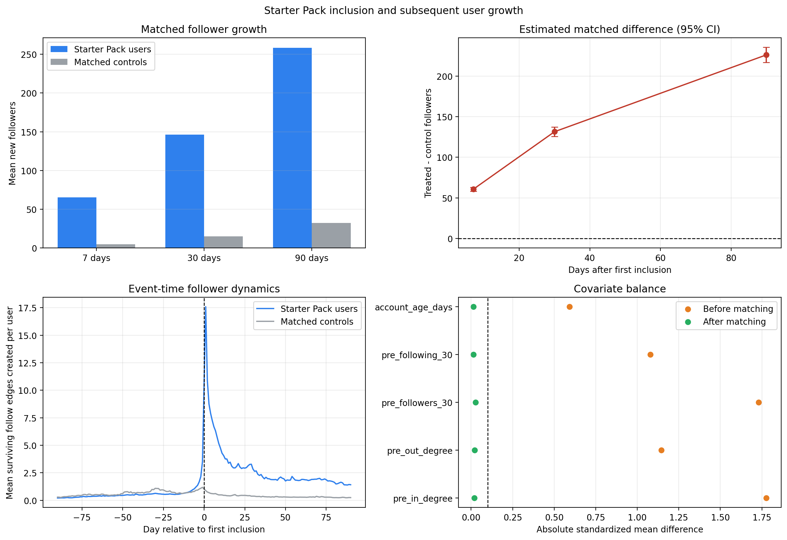
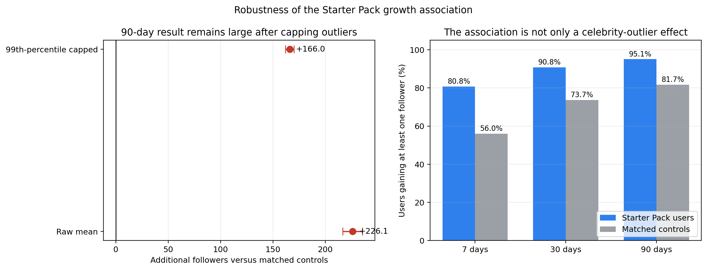
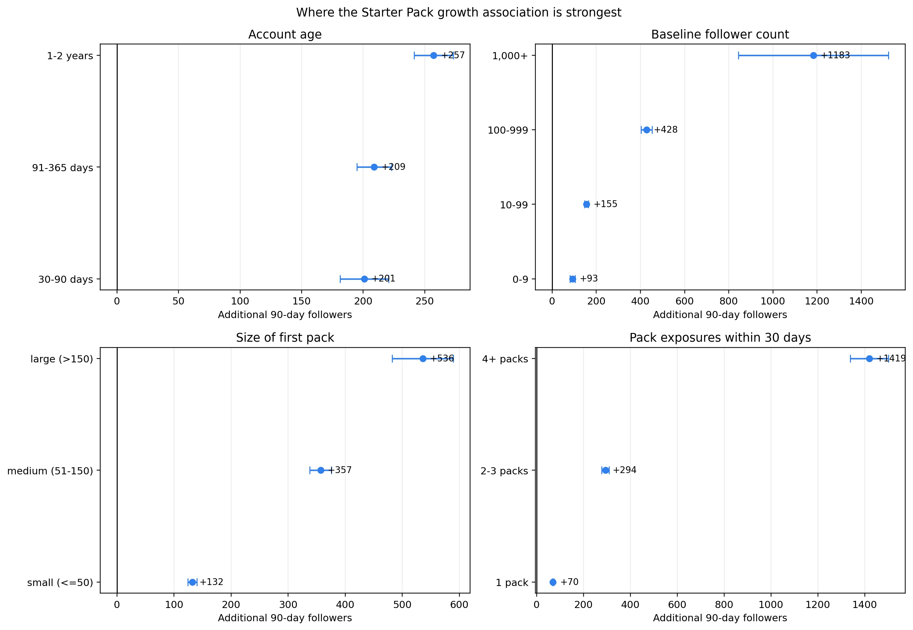
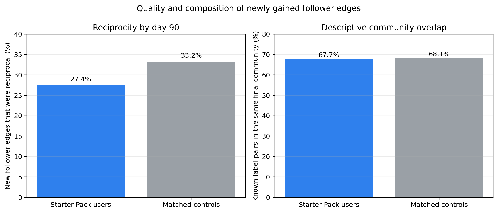

# Starter Pack Inclusion and Subsequent User Growth

This document explains the complete study in plain English: what was measured, how the comparison group was built, what the results mean, what they do not prove, and how to reproduce every output.

## Executive summary

- **Question:** Do users gain more followers after their first appearance in a Bluesky Starter Pack?
- **Data scale:** the complete 2.416-billion-edge follow relation and 2,003,536 unique Starter Pack members.
- **Design:** 100,000 reproducibly sampled Starter Pack users were compared with similar users who remained outside Starter Packs during the 90-day outcome window.
- **Final matched cohort:** 83,914 treated-control pairs.
- **Main result:** Starter Pack users gained an average of 258.52 surviving follower edges within 90 days, compared with 32.46 for matched controls.
- **Robust result:** after capping extreme observations at the 99th percentile, the estimated difference remained +166.04 followers.
- **Conclusion:** first Starter Pack inclusion is strongly associated with faster follower growth, but the observational data cannot prove causation.



## Research question

Is a user's first recorded inclusion in a Bluesky Starter Pack associated with an increase in subsequent follower growth?

This is an observational matched-cohort extension to the paper. It estimates temporal associations. It does not claim that Starter Pack inclusion causes the observed growth.

## Data used

The study reuses the project's prepared DuckDB database and disk-partitioned follow indexes. It combines three data sources:

| Data | Purpose |
|---|---|
| Follow edges | Count incoming and outgoing follows before and after the index date |
| Starter Pack memberships | Find each user's first observable inclusion date and later pack exposures |
| Account records | Measure account creation date, age, and eligibility |

The follow relation contains 2,416,311,437 directed edges. Each surviving edge has a recorded creation date. The Starter Pack membership data contain 2,003,536 unique users.

## What the comparison means

For every treated user, the method tries to find a control observation that looked similar before treatment:

```text
Starter Pack user                        Matched control
-----------------                        ---------------
Similar account age                      Similar account age
Similar existing follower count          Similar existing follower count
Similar existing following count         Similar existing following count
Similar recent 30-day growth              Similar recent 30-day growth
Same seven-day calendar block             Same seven-day calendar block
First Starter Pack appearance             No Starter Pack through day 90
```

Both users are then followed for the same 7-, 30-, and 90-day windows. This is much stronger than simply comparing all Starter Pack users with all other users, because the unmatched groups were very different before treatment.

## Study design

The treatment date is the first day on which a user was observable as a member of any Starter Pack. The analysis uses users first exposed from June 1, 2024 through July 20, 2025, allowing a complete 90-day outcome window before the follow data ends on October 18, 2025.

The implementation:

1. Deduplicates pack memberships and computes the effective exposure date as the later of the pack creation date and member addition date.
2. Selects a deterministic, reproducible sample of 100,000 eligible treated users from 1,084,011 eligible users.
3. Assigns candidate controls index dates drawn from the treated cohort's actual dates.
4. Requires controls to remain outside all Starter Packs through day 90 after their assigned index date.
5. Computes pre-index follower count, following count, recent 30-day follower/following growth, and account age.
6. Fits a ridge-logistic propensity model using only pre-treatment variables.
7. Matches within the same fixed seven-day time block and account-age band, with a propensity-score caliper.
8. Caps reuse of a control account at ten matches.
9. Excludes events dated on day zero because the data contain dates but not within-day timestamps.
10. Measures surviving incoming and outgoing follow edges created during days 1-7, 1-30, and 1-90.

The final cohort contains 83,914 matched treated-control pairs. The propensity model converged, 83.9% of sampled treated users were matched, and all post-match absolute standardized mean differences were below 0.026. A conventional balance threshold is 0.10.

Community was intentionally not used for matching. The available Leiden labels were computed from the later full Starter Pack network and would leak post-treatment information. Community overlap is included only as a descriptive secondary outcome.

## Quality of the matching

The propensity model used five pre-treatment variables:

- log follower count before the index date;
- log following count before the index date;
- follower growth during the previous 30 days;
- following growth during the previous 30 days;
- account age.

Before matching, standardized differences ranged from 0.59 to 1.78, showing that Starter Pack users were systematically different from random controls. After matching, every absolute standardized difference was below 0.026. The conventional target is below 0.10, so measured balance is strong.

## Primary results

| Window | Starter Pack users | Matched controls | Mean difference | 95% cluster-robust CI | Mean ratio |
|---|---:|---:|---:|---:|---:|
| 7 days | 65.39 | 4.76 | +60.63 | 58.13 to 63.12 | 13.74 |
| 30 days | 146.38 | 14.94 | +131.45 | 125.80 to 137.09 | 9.80 |
| 90 days | 258.52 | 32.46 | +226.06 | 216.66 to 235.46 | 7.96 |

These means are strongly right-skewed. The median 90-day values were 41 new followers for treated users and 9 for controls. The 99th-percentile-winsorized 90-day estimate remained large: +166.04 followers, with a 95% confidence interval from 161.90 to 170.17.

The probability of gaining at least one surviving new follower within 90 days was 95.08% for treated users and 81.68% for controls, a difference of 13.39 percentage points (95% CI: 12.99 to 13.80).

The 90-day difference-in-differences estimate compares each group's change from its own preceding 90-day follower count. It was +234.33 followers (95% CI: 224.78 to 243.89).



### Why multiple estimates are reported

Follower growth is highly unequal: a small number of users gain thousands of followers. For that reason, the report does not rely on the raw mean alone:

- the **raw mean** describes total observed growth;
- the **median** describes a more typical user;
- the **99th-percentile-capped estimate** checks whether extreme accounts drive the conclusion;
- the **any-new-follower probability** asks whether the association exists beyond high-volume accounts;
- the **difference-in-differences estimate** compares post-period growth with each user's own earlier growth.

All five views point in the same direction.

## Persistence

The association is strongest immediately after first inclusion and declines over time:

| Period | Incremental treated-control difference | Difference per day |
|---|---:|---:|
| Days 1-7 | +60.63 | +8.66 per day |
| Days 8-30 | +70.82 | +3.08 per day |
| Days 31-90 | +94.62 | +1.58 per day |

The effect therefore persists through 90 days but its daily intensity decays substantially after the first week.

## Subgroup findings

The following are descriptive heterogeneity results, not causal dose-response estimates:

- Users appearing in one pack within 30 days had a 90-day matched difference of +69.72 followers.
- Users appearing in two or three packs had a difference of +293.70.
- Users appearing in four or more packs had a difference of +1,419.43. This group is highly selected and right-skewed.
- Small first packs (at most 50 members) were associated with +131.96 followers.
- Medium first packs (51-150 members) were associated with +356.89.
- Large first packs (more than 150 members) were associated with +535.85.
- Users with fewer than ten baseline followers still had a positive difference of +92.55.
- Users with 100-999 baseline followers had a difference of +427.63.

The multiplicity and pack-size gradients are useful presentation results, but prominent users may be intentionally placed in more and larger packs. They must not be interpreted as proof that adding the same person to more packs would mechanically cause the reported increase.



## Relationship quality

Among surviving incoming follows created during the 90-day window:

- 27.43% were reciprocal by day 90 for Starter Pack users.
- 33.24% were reciprocal for matched controls.
- Among pairs with final community labels, 67.67% of treated-user follows and 68.11% of control follows were within the same final community.

Starter Pack inclusion is therefore associated with substantially more follower acquisition, but the new follower edges are slightly less likely to be reciprocal. Final-community similarity is almost the same between groups, although this comparison is descriptive and has different label coverage.



## Interpretation

The safest conclusion is:

> First recorded Starter Pack inclusion is associated with a large, immediate, and persistent increase in surviving follower edges, even after close matching on observed pre-treatment growth, network degree, account age, and calendar time.

The result is strong enough for a final-project presentation because it contains a clear question, temporal ordering, a defensible control design, balance diagnostics, sensitivity estimates, subgroup analysis, and reproducible outputs. It should be presented as an association rather than a causal effect.

## What can be presented confidently

The following statements are supported by the analysis:

- growth rises sharply immediately after first recorded inclusion;
- the association remains visible throughout the 90-day period;
- it remains large after capping extreme outcomes;
- it is present even when the outcome is only whether a user gained any follower;
- larger packs and multiple pack exposures are associated with larger gains;
- new follower edges for treated users are slightly less likely to be reciprocal;
- measured pre-treatment variables are well balanced after matching.

Avoid saying that Starter Packs *caused* exactly 226 additional followers. A safe presentation phrase is: **"First recorded Starter Pack inclusion was associated with approximately 226 additional surviving follower edges over 90 days in the matched cohort."**

## Important limitations

- Selection into Starter Packs is not random. Unmeasured quality, activity, language, profession, or external popularity can affect both selection and growth.
- The follow dataset is a snapshot of surviving edges with creation dates. Follows that were later removed are unavailable.
- Only date resolution is available, so treatment-day events are excluded rather than ordered.
- The primary cohort is a deterministic sample chosen to run safely on a 32 GB system.
- Matching balances measured variables but cannot balance unobserved confounders.
- Controls can be reused up to ten times. Confidence intervals therefore use control-cluster-robust standard errors.
- Topical pack labels are unavailable. Observable pack size and membership multiplicity are used instead of semantic pack categories.
- Final community labels contain post-treatment information and are descriptive only.

## Validation

The independent validator checks that:

- the saved cohort count matches the JSON summary;
- match identifiers are unique;
- nobody is matched to themselves;
- treated and control observations share the same seven-day time block;
- controls remain outside Starter Packs through day 90;
- 7-, 30-, and 90-day outcomes are monotonic;
- the control-reuse cap is respected;
- day-zero events are absent;
- all post-match balance values are below 0.10;
- the propensity model converged;
- all reported intervals use control-cluster-robust standard errors.

Every validation check passed. The complete machine-readable validation report is in `../outputs/summaries/starterpack_growth_validation.json`.

## Reproduction

Run the complete study from CMD:

```cmd
cd /d E:\final_proj
new_research\starterpack_growth_effect\scripts\run_study.cmd
```

Run independent output validation:

```cmd
new_research\starterpack_growth_effect\scripts\validate_study.cmd
```

Regenerate only the report figures from the saved final result tables:

```cmd
new_research\starterpack_growth_effect\scripts\render_report_figures.cmd
```

The full run took approximately 217 seconds on the 32 GB system. DuckDB used an 18 GB memory limit and a 70 GB safety cap for temporary spill space. The run left no persistent DuckDB spill files.

## Output files

- `new_research/starterpack_growth_effect/outputs/parquet/starterpack_growth_matched_cohort.parquet`: one row per matched pair
- `new_research/starterpack_growth_effect/outputs/parquet/starterpack_growth_effects.parquet`: primary, robust, binary, and difference-in-differences estimates
- `new_research/starterpack_growth_effect/outputs/parquet/starterpack_growth_balance.parquet`: balance before and after matching
- `new_research/starterpack_growth_effect/outputs/parquet/starterpack_growth_dynamics.parquet`: event-time daily means from day -90 through day 90
- `new_research/starterpack_growth_effect/outputs/parquet/starterpack_growth_subgroups.parquet`: age, baseline-degree, pack-size, and pack-count heterogeneity
- `new_research/starterpack_growth_effect/outputs/parquet/starterpack_growth_network_quality.parquet`: reciprocity and descriptive community overlap
- `new_research/starterpack_growth_effect/outputs/figures/starterpack_growth_effect.png`: presentation-ready figure
- `new_research/starterpack_growth_effect/outputs/figures/starterpack_growth_effect.pdf`: vector figure
- `new_research/starterpack_growth_effect/outputs/figures/starterpack_growth_robustness.png`: outlier and binary-outcome sensitivity checks
- `new_research/starterpack_growth_effect/outputs/figures/starterpack_growth_robustness.pdf`: vector robustness figure
- `new_research/starterpack_growth_effect/outputs/figures/starterpack_growth_subgroups.png`: subgroup comparison figure
- `new_research/starterpack_growth_effect/outputs/figures/starterpack_growth_subgroups.pdf`: vector subgroup figure
- `new_research/starterpack_growth_effect/outputs/figures/starterpack_growth_network_quality.png`: reciprocity and community figure
- `new_research/starterpack_growth_effect/outputs/figures/starterpack_growth_network_quality.pdf`: vector relationship-quality figure
- `new_research/starterpack_growth_effect/outputs/summaries/starterpack_growth_effect.json`: complete machine-readable configuration and findings
- `new_research/starterpack_growth_effect/outputs/summaries/starterpack_growth_validation.json`: independent integrity checks

## Implementation files

- `new_research/starterpack_growth_effect/code/analysis.py`
- `new_research/starterpack_growth_effect/tests/test_growth_analysis.py`
- `new_research/starterpack_growth_effect/scripts/run_study.cmd`
- `new_research/starterpack_growth_effect/scripts/validate_study.py`
- `new_research/starterpack_growth_effect/scripts/validate_study.cmd`
- `new_research/starterpack_growth_effect/scripts/render_report_figures.py`
- `new_research/starterpack_growth_effect/scripts/render_report_figures.cmd`
- `new_research/starterpack_growth_effect/code/reporting.py`
- `new_research/starterpack_growth_effect/docs/QUERY_EXAMPLES.sql`
