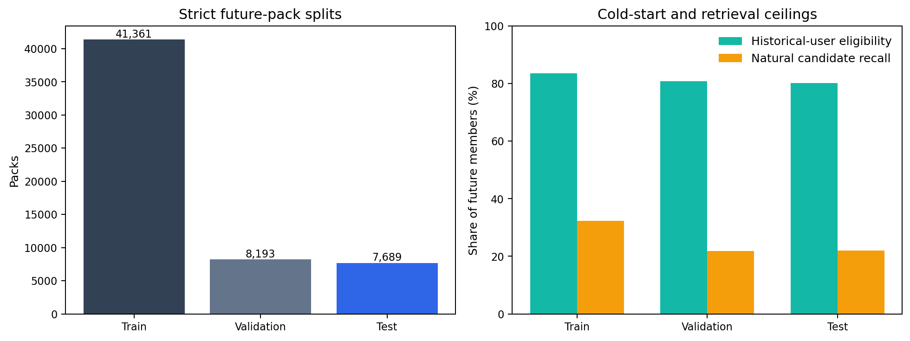
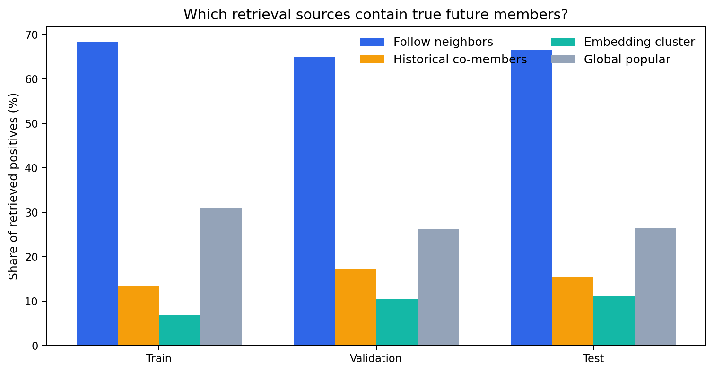
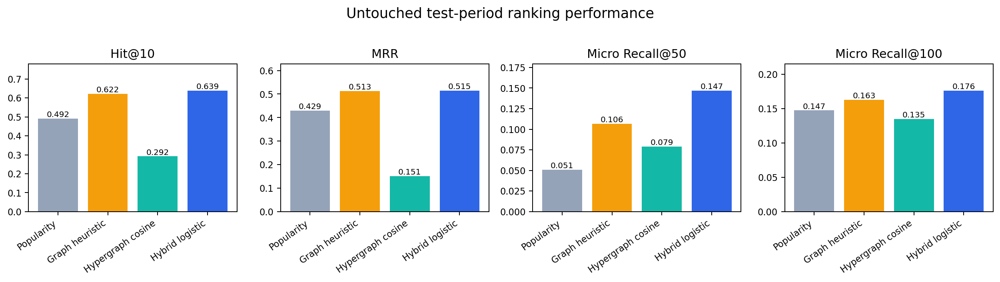

# Time-Split Starter Pack Member Prediction

## Abstract

This study predicts the initial non-creator membership of future Bluesky Starter Packs from a fixed historical graph snapshot. The representation is trained on **296,957** historical packs, **1,684,915** users, and **9,762,636** incidence entries. A 32-dimensional normalized hypergraph SVD is combined with timestamp-safe follow, co-membership, degree, and popularity features. Evaluation uses strict validation and test periods separated by seven-day gaps. On the untouched test period, the hybrid model reaches **Hit@10=0.639**, **MRR=0.515**, and **micro Recall@100=0.176**.

## 1. Problem formulation

For a future pack $e$ with known creator $c_e$ and creation time $t_e$, the system produces a score $s(c_e,v)$ for every retrievable candidate user $v$. No graph edge or pack membership after the historical cutoff is used as an input feature. Positive labels include only non-creator members whose recorded membership date is on or before $t_e$.

## 2. Data and strict time split

| Split | Dates | Packs | Initial members | Historically eligible | Eligibility |
|---|---|---:|---:|---:|---:|
| Train | 2025-02-08 to 2025-05-31 | 41,361 | 1,462,529 | 1,221,315 | 83.51% |
| Validation | 2025-06-08 to 2025-07-31 | 8,193 | 363,504 | 293,550 | 80.76% |
| Test | 2025-08-08 to 2025-09-30 | 7,689 | 309,206 | 247,971 | 80.20% |

The graph snapshot ends on **2025-01-31**. Training begins on **2025-02-08**, validation begins on **2025-06-08**, and testing begins on **2025-08-08**. Each boundary has a seven-day exclusion gap. The local dataset contains follows and Starter Pack membership timestamps but no posts, likes, replies, or repost tables.

## 3. Hypergraph embedding and candidate retrieval

Historical packs are hyperedges. Let $H \in \{0,1}^{|V|\times|E|}$ be the node-hyperedge incidence matrix, $D_v$ the diagonal node-degree matrix, and $D_e$ the diagonal hyperedge-size matrix. The fitted sparse matrix is

$$
B = D_v^{-1/2} H D_e^{-1/2}. \tag{1}
$$

Randomized truncated SVD returns $B \approx U_k\Sigma_kV_k^T$, and each node embedding is the row-normalized vector from $U_k\Sigma_k$. The exact sparse matrix occupies **80.9 MiB** and the 32-dimensional float32 embedding file occupies **205.7 MiB**.

Candidates are retrieved without reading target labels from four sources: pre-cutoff follow neighbors, historical co-members, popular nodes from the creator's embedding cluster, and global popular historical nodes. At most 512 candidates are retained per pack. Test micro candidate recall is **21.95%**, which is the main end-to-end ceiling.

## 4. Rankers

The baselines are historical popularity, a timestamp-safe graph heuristic, and raw hypergraph cosine similarity. The learned model is a regularized logistic ranker using embedding cosine, absolute embedding differences, elementwise products, direct-follow flags, shared-pack counts, retrieval-source flags, and pre-cutoff degree/popularity features. With standardized feature vector $x$, probability is

$$
P(y=1\mid x)=\sigma(w^Tx+b). \tag{2}
$$

The weighted binary cross-entropy is optimized by streaming SGD in 200,000-row batches for three epochs. Training uses **4,063,128** candidate pairs and never loads the full table into Python memory.

## 5. Results

| Split | Model | Hit@10 | MRR | Micro R@50 | Micro R@100 |
|---|---|---:|---:|---:|---:|
| Validation | Popularity | 0.496 | 0.433 | 0.050 | 0.146 |
| Validation | Graph Heuristic | 0.640 | 0.519 | 0.103 | 0.162 |
| Validation | Hypergraph Cosine | 0.326 | 0.167 | 0.080 | 0.135 |
| Validation | Hybrid Logistic | 0.652 | 0.525 | 0.145 | 0.176 |
| Test | Popularity | 0.492 | 0.429 | 0.051 | 0.147 |
| Test | Graph Heuristic | 0.622 | 0.513 | 0.106 | 0.163 |
| Test | Hypergraph Cosine | 0.292 | 0.151 | 0.079 | 0.135 |
| Test | Hybrid Logistic | 0.639 | 0.515 | 0.147 | 0.176 |

The hybrid model improves test micro Recall@100 by **8.35% relative** over the graph heuristic and by **19.63% relative** over popularity. Raw hypergraph cosine is weak by itself, but embedding coordinates add information when combined with direct graph and popularity features.

## 6. Limitations and conclusion

- The fixed representation is intentionally stale after 2025-01-31; this prevents leakage and SVD basis drift but lowers later retrieval coverage.
- Approximately 20% of test members are absent from the historical hypergraph and are true cold-start users.
- The natural candidate pool retrieves only 21.95% of all test positives, so candidate generation is a larger bottleneck than reranking.
- Candidate-source flags overlap, and learned coefficients are correlated descriptive quantities rather than causal effects.
- No posts or general interaction tables exist in the supplied dataset.

The experiment is technically successful: the learned graph-aware ranker consistently beats simple baselines on a chronologically later test period. For future work, the highest-value improvement is a dynamic candidate retriever updated near each pack date, followed by inductive embeddings for cold-start accounts.
